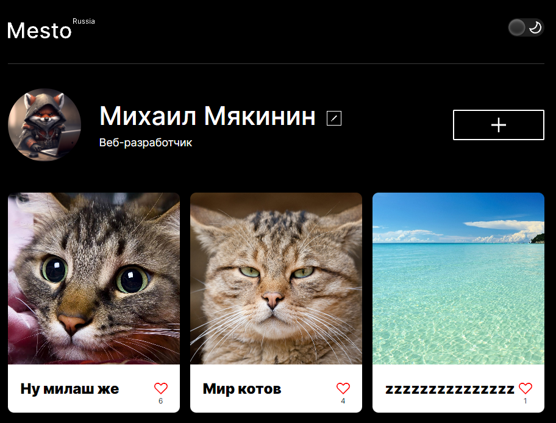

<h1>Учебный frontend-проект "Mesto"</h1>

<h2>Описание проекта</h2>

Данный [проект](https://fe1ch.github.io/mesto/) был сделан в рамках образовательной программы [Яндекс.Практикума.](https://practicum.yandex.ru/) Проект представляет собой создание адаптивного одностраничного сайта с профилем пользователя и фотокарточками - аналога популярных соцсетей - с применением нативных технологий (HTML5, CSS3, JS). В рамках учебного курса он был также портирован на ["React"](https://github.com/fe1ch/mesto-react) и [расширен](https://github.com/fe1ch/react-mesto-auth) добавлением функционала регистрации и авторизации пользователей.

<h2>Макеты Figma</h2>

1. [Базовый макет](https://www.figma.com/file/2cn9N9jSkmxD84oJik7xL7/JavaScript.-Sprint-4?type=design&node-id=0-1&mode=design&t=KS6PDlsHSVdsALkG-0)
2. [Добавление новых модальных окон](https://www.figma.com/file/bjyvbKKJN2naO0ucURl2Z0/JavaScript.-Sprint-5?type=design&node-id=0-1&mode=design&t=3ODPkVGCiQjIZPTx-0)
3. [Валидация форм](https://www.figma.com/file/kRVLKwYG3d1HGLvh7JFWRT/JavaScript.-Sprint-6?type=design&node-id=0-1&mode=design&t=bouugJIsLNyWI0nV-0)
4. [Количество лайков](https://www.figma.com/file/PSdQFRHoxXJFs2FH8IXViF/JavaScript.-Sprint-9?type=design&node-id=0-1&mode=design&t=BpbidFSVEiMAIFnV-0)

<h2>Стек технологий</h2>

<h2>Инструкция по установке</h2>

1. `git clone https://github.com/fe1ch/mesto.git` - клонируем репозиторий
2. `npm i` - устанавливаем зависимости
3. `npm run dev` - запускаем проект в режиме разработчика

<h2>Методология и процесс создания</h2>
Работа была выполнена в 6 этапов:

1. Верстка, реализация открытия и закрытия модального окна с возможностью редактирования данных профиля
2. Добавлено новое модальное окно с добавление карточки на страницу. Интерактивные элементы страницы: добавление и удаление карточки, лайки, открытие фотографии карточки в отдельном модальном окне, плавное открытие и закрытие попапов
3. Валидация форм, закрытие модальных кликом по оверлею и нажатием на клавишу "Escape"
4. Начало рефакторинга (переход к классам): добавление компонентов Card и FormValidator, разбиение на модули, директивы import & export
5. Завершение рефакторинга: структуризация проекта, переписывание функций под 5 новых классов (Section, Popup, PopupWithImage, PopupWithForm, UserInfo), сборка проекта Вебпаком
6. Подключение к серверу: загрузка информации о пользователе, обновление аватара, загрузка карточек (добавление и удаление), счетчик лайков, улучшение UX всех форм

<h2>Планы по доработке</h2>

1. Реализовать периодическое автоматическое обновление фотогалереи
2. Оптимизировать страницу для людей с ограниченными возможностями
3. Сделать код более кроссбраузерным
4. Адаптировать под различные устройства
